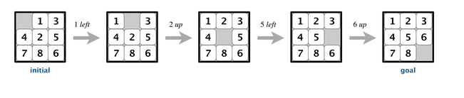

### Problem:

The 8-puzzle is a sliding puzzle that is played on a 3-by-3 grid with 8 square tiles labeled 1 through 8, plus a blank
square.
The goal is to rearrange the tiles so that they are in row-major order, using as few moves as possible.
You are permitted to slide tiles either horizontally or vertically into the blank square.

The following diagram shows a sequence of moves from an initial board (left) to the goal board (right):

#### Hamming Distance/ Manhatten Distance:

To measure how close a board is to the goal board, we define two notions of distance.
The Hamming distance betweeen a board and the goal board is the number of tiles in the wrong position.
The Manhattan distance between a board and the goal board is the sum of the Manhattan distances
(sum of the vertical and horizontal distance) from the tiles to their goal positions.

### A* Search:

Now, we describe a solution to the 8-puzzle problem that illustrates a general artificial intelligence methodology known
as the A* search algorithm.
We define a search node of the game to be a board, the number of moves made to reach the board, and the previous search
node.
First, insert the initial search node (the initial board, 0 moves, and a null previous search node) into a priority
queue.
Then, delete from the priority queue the search node with the minimum priority,
and insert onto the priority queue all neighboring search nodes (those that can be reached in one move from the dequeued
search node).
Repeat this procedure until the search node dequeued corresponds to the goal board.

The efficacy of this approach hinges on the choice of priority function for a search node. We consider two priority
functions:

1. The Hamming priority function is the Hamming distance of a board plus the number of moves made so far to get to the
   search node.
   Intuitively, a search node with a small number of tiles in the wrong position is close to the goal, and we prefer a
   search node if has been reached using a small number of moves.

2. The Manhattan priority function is the Manhattan distance of a board plus the number of moves made so far to get to
   the search node.

To solve the puzzle from a given search node on the priority queue, the total number of moves we need to make (including
those already made) is at least its priority, using either the Hamming or Manhattan priority function. Why?
Consequently, when the goal board is dequeued, we have discovered not only a sequence of moves from the initial board to
the goal board, but one that makes the fewest moves.

### Game Tree:

One way to view the computation is as a game tree, where each search node is a node in the game tree
and the children of a node correspond to its neighboring search nodes.
The root of the game tree is the initial search node; the internal nodes have already been processed;
the leaf nodes are maintained in a priority queue;
at each step, the A* algorithm removes the node with the smallest priority from the priority queue
and processes it (by adding its children to both the game tree and the priority queue).

For example, the following diagram illustrates the game tree after each of the first three steps
of running the A* search algorithm on a 3-by-3 puzzle using the Manhattan priority function.

